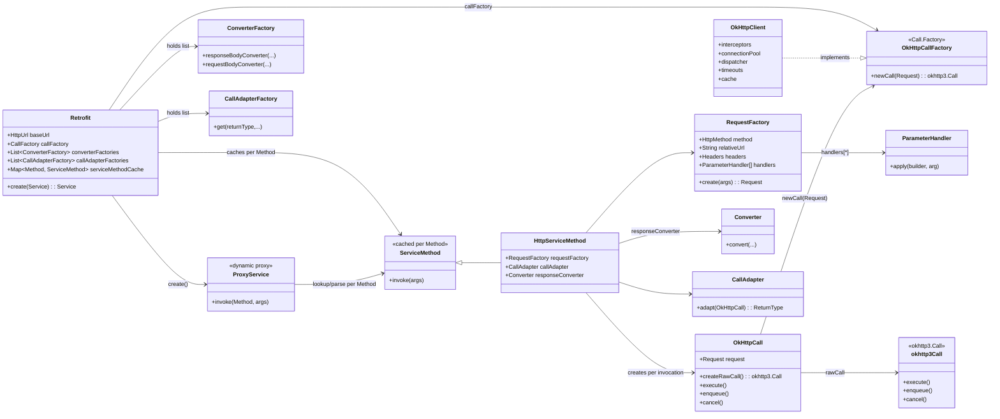
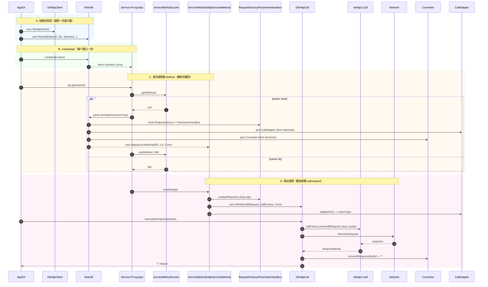

# Retrofit 核心对象职责图谱：2 张“可落地”图（Mermaid）

> 使用 Mermaid：可直接粘贴到支持 Mermaid 的 Markdown 渲染器（GitHub、语雀、Obsidian、Notion 部分模式、Mermaid Live Editor 等）。

---

## 图 1：静态职责/对象关系图（Class / Dependency Map）

---

## 图 2：动态创建时机/调用时序图（Lifecycle + Cache + Per-call）

---
## 使用说明
- **图 1**：用于“职责/依赖/对象边界”讨论（架构评审最常用）。
- **图 2**：用于“性能/创建次数/缓存命中/调用链路”讨论（定位慢启动与首次调用开销）。

如果你希望我按你们的技术栈把图里的返回类型细化（例如 `suspend`、`Flow`、RxJava2/3、Kotlin Serialization、Moshi、Gson），告诉我你使用的组合，我可以把 `CallAdapter/Converter` 分支在图上展开。