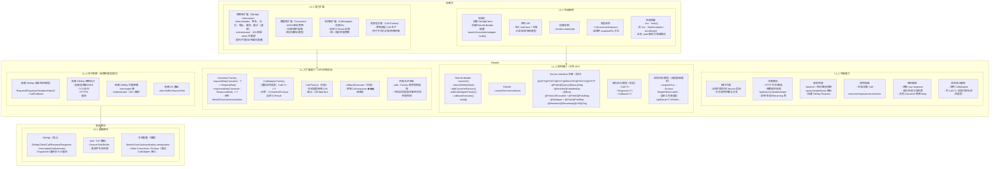

# Retrofit 内外关系梳理

> 说明：`mermaid.live` 对节点文本里的 `\n` 往往会“原样显示”，不换行。  
> 更稳的做法是：在节点里用 HTML 的 ` ` 来换行（同时把 `<` `>` 转义成 `&lt;` `&gt;`，避免被当成标签或破坏解析）。

```mermaid
flowchart TB
  %% =======================
  %% L1 Retrofit
  %% =======================
  subgraph L1["Retrofit"]
    direction TB

    subgraph L1_1["L1_1 内部能力"]
      direction TB
      L1_1_a["接口代理<br/>- 动态代理生成 Service 实现<br/>- 方法调用拦截与分发"]
      L1_1_b["注解解析<br/>- HTTP 方法/路径<br/>- 参数绑定规则（path/query/header/body）<br/>- 表单/多段/Streaming 等"]
      L1_1_c["请求组装<br/>- baseUrl + 相对路径拼接<br/>- query/header/body 编码<br/>- 构建 OkHttp Request"]
      L1_1_d["调用抽象<br/>- 生成/封装 Call<br/>- execute/enqueue/cancel/clone"]
      L1_1_e["响应编排<br/>- 获取 raw response<br/>- 成功/失败分支处理<br/>- 交给 Converter 转换 body"]
      L1_1_f["返回语义编排<br/>- 调用 CallAdapter<br/>- 将 Call&lt;T&gt; 适配为目标返回类型"]
    end

    subgraph L1_2["L1_2 调用接口（对外 API）"]
      direction TB
      L1_2_a["Retrofit.Builder<br/>- baseUrl()<br/>- client(OkHttpClient)<br/>- addConverterFactory()<br/>- addCallAdapterFactory()<br/>- callbackExecutor()<br/>- build()"]
      L1_2_b["Retrofit<br/>- create(ServiceInterface)"]
      L1_2_c["Service Interface 注解（契约）<br/>- @GET/@POST/@PUT/@DELETE/@PATCH/@HTTP<br/>- @Path/@Query/@QueryMap<br/>- @Header/@HeaderMap<br/>- @Body<br/>- @FormUrlEncoded + @Field/@FieldMap<br/>- @Multipart + @Part/@PartMap<br/>- @Headers/@Streaming/@Url/@Tag"]
      L1_2_d["返回/执行模型（表层）<br/>- Call&lt;T&gt;<br/>- Response&lt;T&gt;<br/>- Callback&lt;T&gt;"]
      L1_2_e["返回/执行模型（由适配器提供）<br/>- suspend fun ...<br/>- RxJava Single/Observable/...<br/>- 自定义包装类型 ApiResult&lt;T&gt;/Either/..."]
    end

    subgraph L1_3["L1_3 扩展能力（SPI/可插拔点）"]
      direction TB
      L1_3_a["Converter.Factory<br/>- requestBodyConverter：T -&gt; RequestBody<br/>- responseBodyConverter：ResponseBody -&gt; T<br/>- 示例：Moshi/Gson/Jackson/kotlinx"]
      L1_3_b["CallAdapter.Factory<br/>- 适配返回类型：Call&lt;T&gt; -&gt; X<br/>- 示例：Coroutine/RxJava/自定义 Result"]
      L1_3_c["Call.Factory（可选）<br/>- 生成底层网络 Call<br/>- 默认：OkHttpClient"]
      L1_3_d["callbackExecutor（可选）<br/>- 控制 Call.enqueue ���调线程"]
      L1_3_e["匹配与优先级<br/>- add...Factory 顺序影响选择<br/>- 不同返回类型/注解组合的匹配规则"]
    end

    subgraph L1_4["L1_4 向下依赖（依赖的底层能力）"]
      direction TB
      L1_4_a["依赖 OkHttp 请求/响应模型<br/>- Request/Response/Headers/HttpUrl<br/>- Call/Callback"]
      L1_4_b["依赖 OkHttp 网络执行<br/>- 连接池/路由/DNS<br/>- TLS/证书<br/>- HTTP/2<br/>- 缓存"]
      L1_4_c["依赖 OkHttp 扩展链路<br/>- Interceptor 链<br/>- Authenticator（401 刷新）"]
      L1_4_d["依赖 I/O 基础<br/>- okio Buffer/Source/Sink"]
    end
  end

  %% =======================
  %% L2 依赖方
  %% =======================
  subgraph L2["依赖方"]
    direction TB

    subgraph L2_1["L2-1 外部调用"]
      direction TB
      L2_1_a["初始化<br/>- 创建 OkHttpClient<br/>- 创建 Retrofit.Builder<br/>- 配置 baseUrl/converter/adapter<br/>- build()"]
      L2_1_b["声明 API<br/>- 定义 interface + 注解<br/>- 约定请求/响应模型"]
      L2_1_c["创建实例<br/>- retrofit.create(Api)"]
      L2_1_d["发起请求<br/>- Call.execute/enqueue<br/>- 或调用 suspend/Rx 方法"]
      L2_1_e["处理结果<br/>- 2xx：body()<br/>- 非 2xx：HttpException / errorBody()<br/>- 业务 code 映射为领域错误"]
    end

    subgraph L2_2["L2-2 能力扩展"]
      direction TB
      L2_2_a["网络侧扩展（OkHttp）<br/>- Interceptor：token/header、签名、日志、埋点、缓存、重试（谨慎）<br/>- Authenticator：401 刷新 token 并重放<br/>- 超时/代理/证书/缓存配置"]
      L2_2_b["数据侧扩展（Converter）<br/>- JSON 解析策略<br/>- 日期/枚举/容错<br/>- 错误体解析模型"]
      L2_2_c["返回侧扩展（CallAdapter）<br/>- 协程/Rx<br/>- 自定义 Result 封装<br/>- 统一错误传播策略"]
      L2_2_d["更底层扩展（Call.Factory）<br/>- 替换底层 Call 生产<br/>- 用于平台化封装/特殊传输"]
    end
  end

  %% =======================
  %% L3 底层模块
  %% =======================
  subgraph L3["底层模块"]
    direction TB

    subgraph L3_1["L3-1 依赖模块"]
      direction TB
      L3_1_a["OkHttp（核心）<br/>- OkHttpClient/Call/Request/Response<br/>- Interceptor/Authenticator<br/>- Dispatcher/连接池/TLS/缓存"]
      L3_1_b["okio（I/O 基础）<br/>- Source/Sink/Buffer<br/>- 高效字节流处理"]
      L3_1_c["生态配套（按需）<br/>- Moshi/Gson/Jackson/kotlinx.serialization<br/>- Kotlin Coroutines / RxJava（通过 CallAdapter 接入）"]
    end
  end

  %% =======================
  %% 关系（保持用户给定关系）
  %% =======================
  L2_1 --> L1_2
  L2_2 --> L1_3
  L1_4 --> L3_1
```