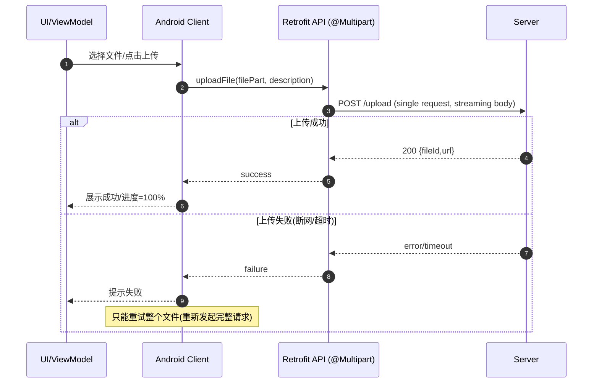
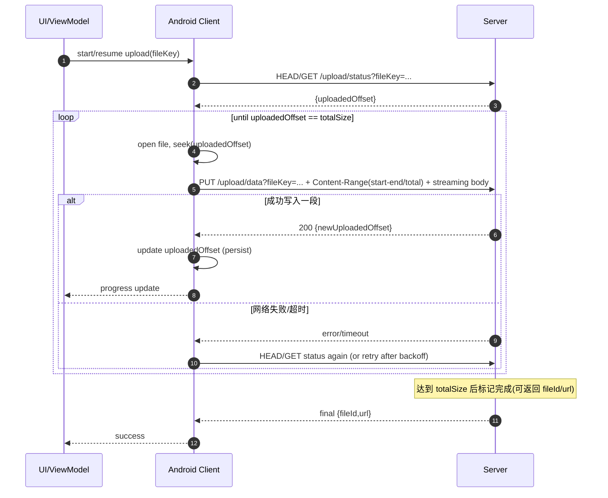
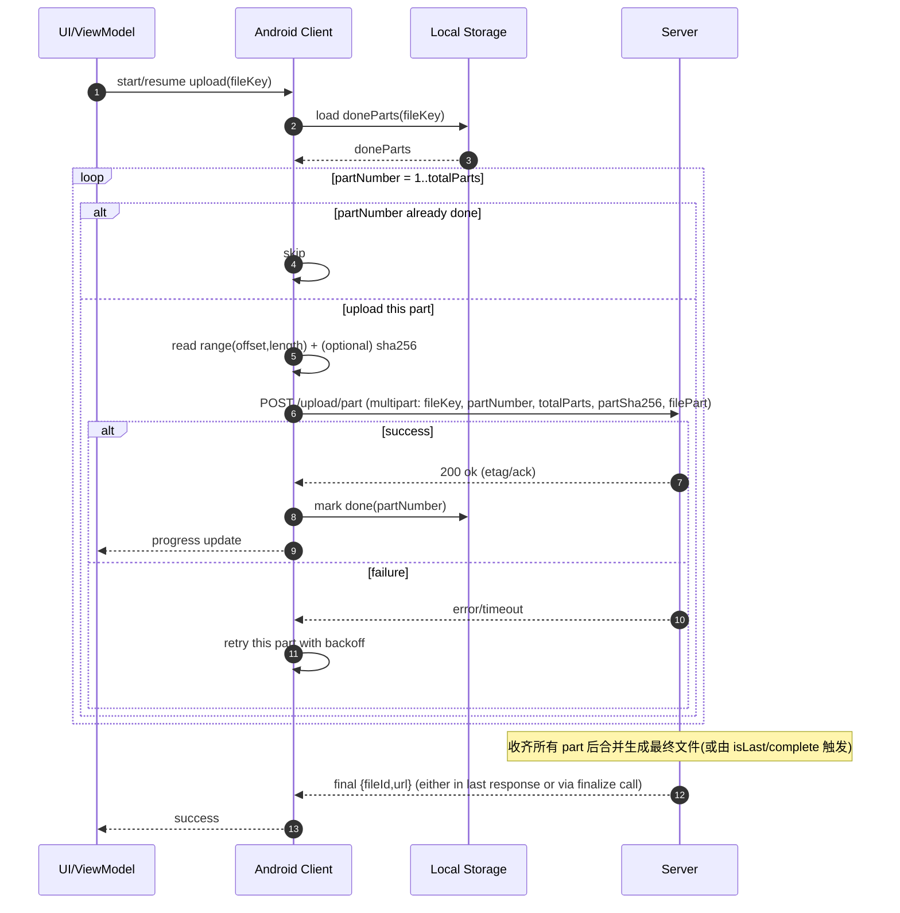

# Android 文件上传方案整理（Kotlin / Retrofit）+ Mermaid 图（更新版：含方案A的Kotlin示例）

本文将上传方案按“是否客户端分片”,“是否支持断点续传”分为 3 类，并分别给出详细说明与 Mermaid 图。  
**已将你给出的 Kotlin Retrofit `@Multipart uploadFile(...)` 示例整合进方案 A。**

---

## 0. 术语澄清（避免误解）

- **HTTP/TCP 传输层的分段/分帧**（TCP segment、HTTP/2 frame）  
  这是网络传输细节，对业务不可见，**不能用于断点续传或按“第 N 片”落盘**。
- **业务层分片/分段上传**  
  指：客户端与服务端在协议层明确约定 `partNumber` 或 `offset`，使服务端能够“按片/按区间”持久化与校验，从而实现重试与断点续传。

---

## 1) 方案 A：单次上传（客户端不分片；失败重传整个文件）

### 1.1 适用场景
- 文件较小（或网络稳定，且可接受失败重传全量）
- 希望服务端接口最简单
- 不强求断点续传

### 1.2 Kotlin / Retrofit 接口示例（你提供的代码，归属本方案）
> 该接口只有 **一个文件 Part**，属于“单次上传”。失败后只能重传整个文件，不具备按片续传能力。

```kotlin
@Multipart
@POST("upload")
suspend fun uploadFile(
    @Part file: MultipartBody.Part,
    @Part("description") description: String
): UploadResult
```

**为什么它属于方案 A：**
- 一次请求发送整个文件；
- `description` 只是附加文本字段，不含 `partNumber/totalParts/uploadId/offset` 等续传元数据；
- 传输层虽然会自动分段，但业务层不可感知，服务端也无法据此“从断点继续”。

### 1.3 客户端实现要点（Android / Kotlin）
- **一个请求**完成上传；
- 使用**流式**请求体（RequestBody/okio）避免 OOM：
  - 文件不需要整体读入内存；
  - 但**失败只能重新上传整个文件**。
- Retrofit 形式：
  - 可用 `@Multipart` + 单个 `MultipartBody.Part`（表单上传风格，与你的接口一致）
  - 或 `@Body` 直接上传（更纯粹的“上传二进制”）

### 1.4 服务端要求
- 单接口接收文件并保存
- 可选：校验（Content-Length、hash）

### 1.5 优缺点
**优点**
- 实现最简单
- 请求数最少

**缺点**
- 不支持断点续传
- 大文件在移动网络下失败成本高（全量重传）

### 1.6 Mermaid（流程图）


---

## 2) 方案 B：可恢复上传（客户端不“预切片管理”，但按 offset 续传；Resumable/Range 协议）

> 重要：想要断点续传，客户端必须能“从某个 offset 开始继续发送后续字节”。  
> 这不是 HTTP 自动完成的，需要**应用层续传协议**（offset/range + 服务端状态）。

### 2.1 适用场景
- 大文件上传，要求断点续传，且希望减少“分片编号、N 次请求”的管理复杂度
- 服务端可配合实现 resumable 协议（或使用现成协议，如 tus / 云厂商 resumable API）

### 2.2 协议形态（常见做法）
实现方式很多，这里给出一个通用思路（不绑定某一云厂商）：

1. **查询已接收字节数**（HEAD/GET）  
   - 客户端询问：`fileKey` 对应的上传进度（例如已保存到 offset=12345）
2. **继续上传剩余字节**（PUT/POST）  
   - 客户端从本地文件 offset 处开始读取并发送
   - 带上类似 `Content-Range: bytes <start>-<end>/<total>` 或自定义 header
3. 服务端：
   - 校验 offset 连续性
   - 追加写入临时文件（append）或随机写（seek）

> 注意：这类方案通常不使用 `@Multipart + @Part`，更偏向 `PUT` + `@Body` 流式二进制；当然也能“强行放进 multipart”，但收益不大、复杂度更高。

### 2.3 客户端实现要点
- **不需要维护 partNumber 列表**，但需要：
  - 查询服务端已收 offset（或从本地持久化恢复）
  - 构造“从 offset 开始的流式 RequestBody”
- 失败重试：从最新 offset 继续，节省流量

### 2.4 服务端要求（关键）
- 必须保存上传状态（至少已写入的最大 offset）
- 支持幂等/一致性：
  - 同一 offset 重复上传应可处理（覆盖或忽略）
  - 禁止跳跃 offset（避免文件空洞/乱序）

### 2.5 优缺点
**优点**
- 支持断点续传
- 不需要按“第 N 片”管理与合并（没有显式 complete 的话，也可在达到 total 自动完成）

**缺点**
- 服务端实现门槛更高（状态 + 追加写/随机写 + offset 校验��
- 需要额外“查询进度/状态”的接口（哪怕不是 init，也要能问 offset）

### 2.6 Mermaid（流程图）


---

## 3) 方案 C：客户端分片上传（N 片、N 次请求；@Multipart + @Part 最匹配；可断点续传）

### 3.1 适用场景
- 需要断点续传、重试、并发加速
- 服务端易于实现：以 `partNumber` 存储分片，最后合并
- 希望与 Retrofit `@Multipart + @Part` 自然契合

### 3.2 协议形态（典型字段）
每个分片请求包含：
- `fileKey` 或 `uploadId`（标识同一文件上传会话）
- `partNumber`（1..totalParts）
- `totalParts`
- `partSize`
- `partSha256`（推荐）
- `file`（本分片二进制）

会话管理有两种常见变体：
- **C1-标准**：`init` 返回 `uploadId` + `uploadedParts`，上传完再 `complete` 合并  
- **C2-精简**：不显式 init/complete，用 `fileKey` 标识，服务端在“收齐后自动合并”或由 `isLast` 触发合并  
（无论哪种，核心仍是“按 partNumber 传 N 次”）

### 3.3 客户端实现要点
- 分片策略：partSize（2MB~10MB）
- Range 读取：按 offset/length 读取文件片段（不必真的切成多个物理小文件）
- 并发：Semaphore 控制 3~4 并发上传
- 断点续传：
  - 本地持久化已完成 partNumber 集合
  - 或服务端提供已收分片查询（推荐）
- 重试：按片重试，成本低

### 3.4 服务端要求
- 能存储分片（以 `uploadId/fileKey + partNumber` 定位）
- 幂等：同一片重复上传要可处理
- 合并：收齐后合并成最终文件（或 complete 触发）

### 3.5 优缺点
**优点**
- 断点续传能力强、实现成熟通用
- 失败重试成本低（仅重传失败片）
- 支持并发提升速度

**缺点**
- 请求次数多（N 次）
- 服务端需要分片存储与合并逻辑

### 3.6 Mermaid（流程图：以“精简版 fileKey + partNumber”表达核心）


---

## 4) 一句话对比（决策快速参考）

- **A 单次上传**：最简单；失败重传全量；不续传（你的 `uploadFile(@Part file...)` 就是此类）  
- **B 可恢复上传（offset）**：不管“第几片”；从 offset 续传；服务端最难  
- **C 分片上传（partNumber）**：最通用、最适配 `@Multipart + @Part` 的断点续传；请求数多但易控

---