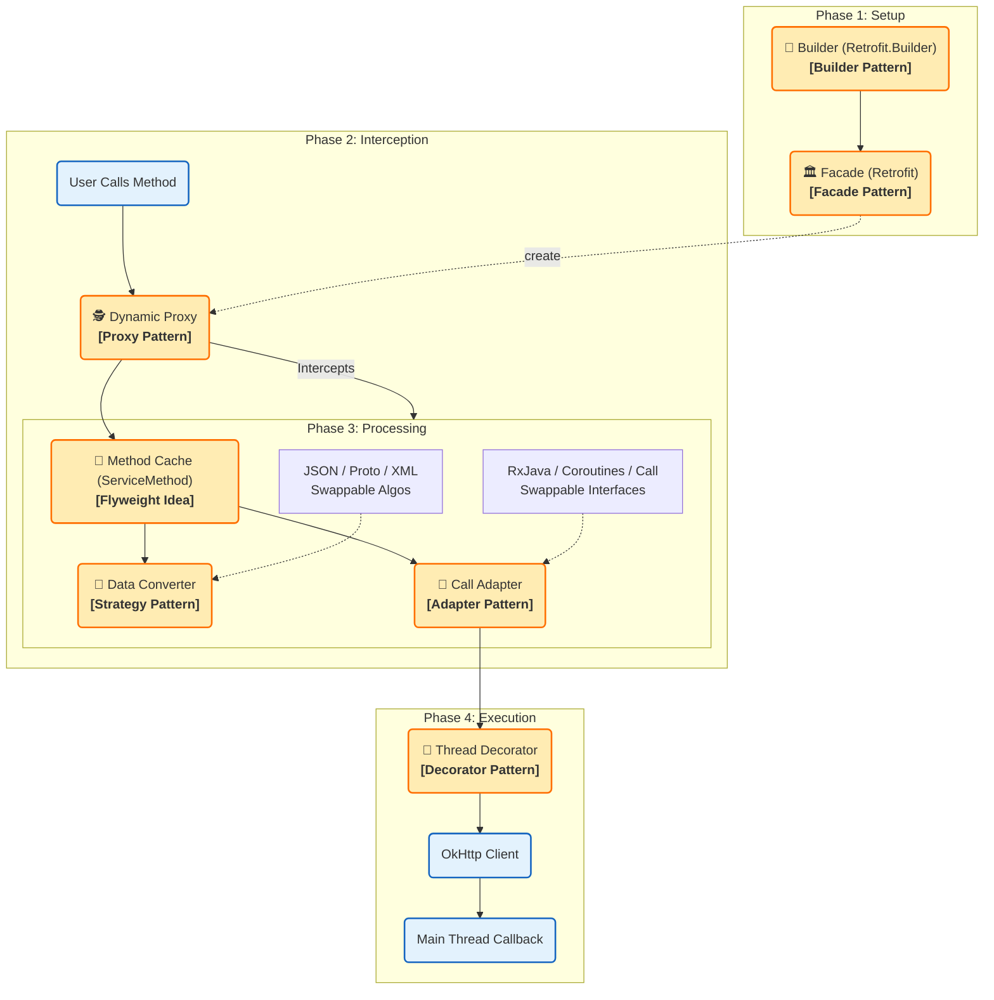
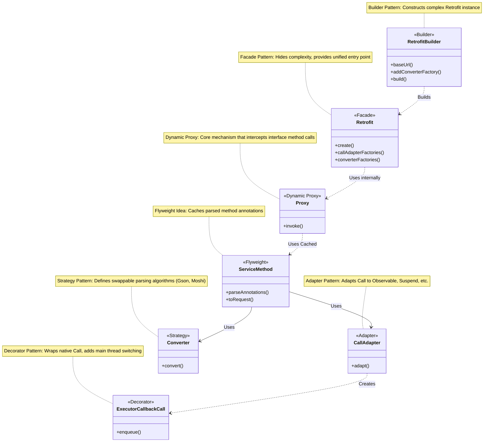

# Retrofit 架构设计模式全解

Retrofit 是一个典型的**大量使用设计模式**的框架，其核心设计理念在于将**接口定义**与**网络实现**解耦。

> **修复说明**：已移除 Mermaid 图表中导致乱码的 `\n` 换行符，类图注释改为单行显示，流程图使用兼容性更好的 HTML 标签。

---

## 一、 宏观视角：核心模块运行流程

下图展示了 Retrofit 从构建到请求执行的四个阶段。

---

## 二、 微观视角：详细类结构图

下图展示了 Retrofit 内部具体类的关系结构。

---

## 三、 设计模式详细解析（中文对照）

### 1. 动态代理模式 (Dynamic Proxy Pattern) —— **Core**
*   **对应图示**：`Proxy` / `Dynamic Proxy`
*   **作用**：Retrofit 的灵魂。开发者只需要定义 Interface，Retrofit 利用动态代理拦截方法调用，解析注解并生成 HTTP 请求。

### 2. 外观模式 (Facade Pattern)
*   **对应图示**：`Retrofit` / `Facade`
*   **作用**：`Retrofit` 类是门面。内部管理复杂的配置，对外只暴露 `create()` 等简单接口，降低使用门槛。

### 3. 建造者模式 (Builder Pattern)
*   **对应图示**：`RetrofitBuilder` / `Builder`
*   **作用**：解决配置项（BaseUrl, Client, Converters 等）过多的问题，支持链式调用，清晰构建复杂对象。

### 4. 策略模式 (Strategy Pattern)
*   **对应图示**：`Converter` / `Strategy`
*   **作用**：数据解析算法可插拔。无论是 JSON (Gson)、XML 还是 Protobuf，都实现了统一接口，可在运行时互换。

### 5. 适配器模式 (Adapter Pattern)
*   **对应图示**：`CallAdapter` / `Adapter`
*   **作用**：将默认的 `Call` 对象适配成其他形式，如 RxJava 的 `Observable` 或 Kotlin 的 `Deferred`。

### 6. 装饰器模式 (Decorator Pattern)
*   **对应图示**：`ExecutorCallbackCall` / `Decorator`
*   **作用**：在内部包装了原始的 `Call` 对象。它不改变接口，但增加了“将结果自动切回主线程”的功能。

### 7. 享元模式思想 (Flyweight Pattern Idea)
*   **对应图示**：`ServiceMethod` / `Flyweight`
*   **作用**：缓存已解析的方法注解（Method -> ServiceMethod）。避免每次请求都进行耗时的反射操作。

---

### 特别说明：关于职责链模式

**注意：** 图表中不包含 **职责链模式 (Chain of Responsibility)**。
该模式主要存在于底层依赖库 **OkHttp** 中（拦截器链），Retrofit 本身作为上层封装，通过上述模式将逻辑解耦，并未直接使用责任链。