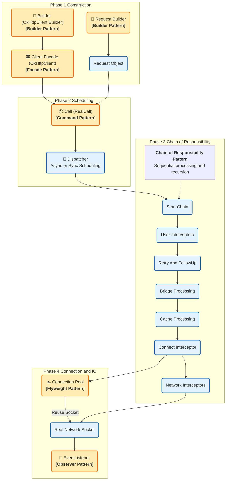
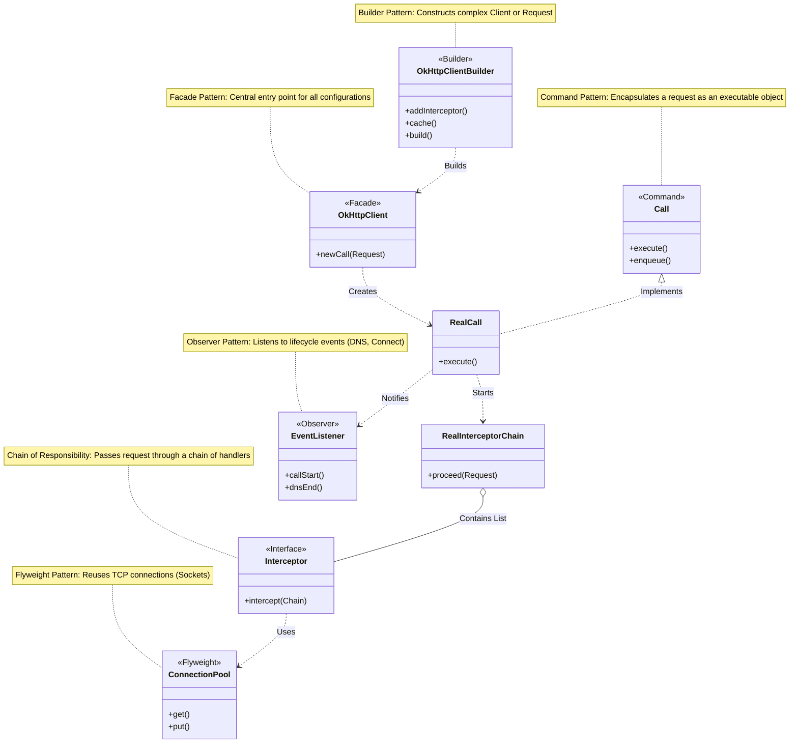

# OkHttp 架构设计模式全解

OkHttp 是 Android/Java 领域最底层的 HTTP 客户端，其架构设计的核心目标是**高效**、**可扩展**与**容错**。与 Retrofit 不同，OkHttp 处理的是真实的 TCP 连接、I/O 操作和协议细节。

> **修复说明**：已移除 Mermaid 图表中所有可能导致解析错误的特殊符号（如子图标题中的括号）。

---

## 一、 宏观视角：核心模块运行流程

下图展示了 OkHttp 从请求构建、调度、拦截链处理到连接池复用的完整流程。

---

## 二、 微观视角：详细类结构图

下图展示了 OkHttp 内部核心类及其对应的设计模式。

---

## 三、 设计模式详细解析（中文对照）

### 1. 职责链模式 (Chain of Responsibility Pattern) —— **核心灵魂**
*   **对应图示**：`Interceptor` / `RealInterceptorChain`
*   **作用**：这是 OkHttp **最精彩**的设计。
    *   OkHttp 将网络请求的各个步骤拆解为一个个拦截器：重试、桥接（加Header/Gzip）、缓存、建立连接、发送数据。
    *   这些拦截器组成一条链。请求像流水线一样经过每个拦截器，每个拦截器可以处理请求、短路请求（直接返回缓存），或者递归调用下一个拦截器。
    *   **核心类**：`RetryAndFollowUpInterceptor`, `BridgeInterceptor`, `CacheInterceptor`, `ConnectInterceptor`, `CallServerInterceptor`。

### 2. 建造者模式 (Builder Pattern)
*   **对应图示**：`OkHttpClient.Builder` / `Request.Builder`
*   **作用**：OkHttp 中随处可见。
    *   一个 HTTP 请求包含 URL, Method, Headers, Body 等，组合极其复杂。
    *   客户端配置包含超时时间、DNS、CookieJar、拦截器等。
    *   使用 Builder 模式可以优雅地构建这些不可变对象（Immutable Objects）。

### 3. 享元模式 (Flyweight Pattern)
*   **对应图示**：`ConnectionPool` (连接池)
*   **作用**：HTTP/1.1 支持长连接 (Keep-Alive)，HTTP/2 支持多路复用。
    *   建立 TCP 连接（三次握手）和 TLS 握手是非常耗时耗资源的。
    *   `ConnectionPool` 作为一个对象池（享元思想的变体），缓存了真实的 Socket 连接。
    *   当发起新请求时，先去池里找有没有可复用的连接，避免重复创建，极大提升性能。

### 4. 命令模式 (Command Pattern)
*   **对应图示**：`Call` / `RealCall`
*   **作用**：
    *   `OkHttpClient.newCall(request)` 返回的 `Call` 对象就是一个“命令”。
    *   它将“请求参数”和“执行逻辑”封装在了一个对象中。
    *   你可以持有这个命令对象，随时选择调用 `execute()` (同步) 或 `enqueue()` (异步)，甚至 `cancel()` (取消)。

### 5. 观察者模式 (Observer Pattern)
*   **对应图示**：`EventListener`
*   **作用**：
    *   想要监控网络请求的每一个细节（DNS 解析耗时、握手耗时、首包时间）？
    *   OkHttp 提供了 `EventListener`。系统作为被观察者，在请求生命周期的关键节点（CallStart, DnsEnd, ConnectStart...）主动通知观察者。

### 6. 策略模式 (Strategy Pattern)
*   **对应图示**：`CookieJar` / `Dns` / `Authenticator`
*   **作用**：
    *   **Cookie 管理**：默认不管理，你可以传入 `JavaNetCookieJar` 或自定义实现。
    *   **DNS 解析**：默认用系统 DNS，你可以传入 `HttpDns` 实现来防劫持。
    *   这些具体的行为实现是可以热替换的，体现了策略模式。

---

### 总结：Retrofit 与 OkHttp 的设计差异

*   **Retrofit** 偏向 **“结构型”** 设计模式（外观、代理、适配器），重点在于**接口封装**和**解耦**。
*   **OkHttp** 偏向 **“行为型”** 设计模式（职责链、命令、观察者），重点在于**流程控制**和**性能优化**。