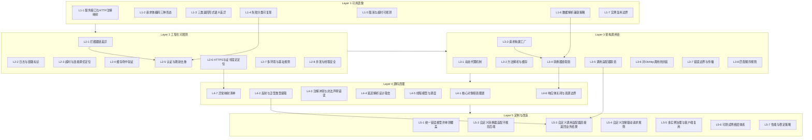

# Kotlin 客户端领域：Retrofit「从表象到原理」分层学习路线（目标：熟悉原理与架构）
日期：2026-01-27  
学习者：tttuser

> 说明：你遇到的 Mermaid 解析错误，主要来自 **节点文本里包含括号/特殊符号**（如 `create()`、`ResponseBody↔T`、`@Host/@NoAuth` 等）在部分渲染器下会触发语法歧义。下面我把 **所有节点文本改成纯文字**（不含括号、箭头、@、斜杠等），并用 `id["text"]` 形式输出，兼容 GitHub Mermaid 渲染。

---

## 1) 分层说明（每层一句话）

1. **第 1 层：会用（表象）**——能写接口、发请求、解析响应、处理常见失败与取消。  
2. **第 2 层：用得稳（工程化与可观测）**——能配置拦截器、日志、超时、缓存、鉴权、HTTPS、多环境并可定位问题。  
3. **第 3 层：看懂架构（调用链与扩展点）**——能拆解一次调用的全链路组件与扩展点匹配规则。  
4. **第 4 层：读懂关键源码（原理）**——能沿核心源码路径解释类职责、反射泛型、线程与异常边界。  
5. **第 5 层：能定制与改造（高级）**——能自定义转换与适配、统一错误模型、增强可测试性与性能稳定。

---

## 2) 每层关键能力点列表（带简短解释）

### 第 1 层：会用（表象）
- **L1-1 服务接口与 HTTP 注解映射**：用 MockWebServer 断言 URL、方法、header 是否正确。  
- **L1-2 请求体编码三种形态**：分别实现 JSON、表单、Multipart，并抓包确认 Content-Type 与 body。  
- **L1-3 三类返回形式的语义差异**：对比 Call、挂起函数、响应包装在成功/失败时的行为。  
- **L1-4 失败分类可复现**：构造 404、断网、非法 JSON，输出可区分的错误来源。  
- **L1-5 取消与超时可观测**：取消协程或 Call，确认 OkHttp 层确实终止。  
- **L1-6 数据解析兼容策略**：缺字段、多字段、类型变动时的默认值/失败策略。  
- **L1-7 实例复用边界**：Retrofit 与 Service 复用是否影响性能与解析次数。

### 第 2 层：用得稳（工程化与可观测）
- **L2-1 拦截器链差异**：证明应用拦截器与网络拦截器在缓存与重定向上的差别。  
- **L2-2 日志与链路标识**：实现请求 ID、脱敏，能串起一次请求全流程。  
- **L2-3 超时与连接调优定位**：用同一接口量化不同超时配置的行为差异。  
- **L2-4 缓存命中验证**：断网条件下验证强缓存与协商缓存命中。  
- **L2-5 认证与刷新去重**：并发请求只触发一次刷新，可用计数断言。  
- **L2-6 HTTPS 与证书固定定位**：能区分握手失败与业务失败，并复现 pinning 失败。  
- **L2-7 多环境与基址规则**：实现环境切换并验证 baseUrl 规则。  
- **L2-8 并发与线程安全**：证明挂起调用不阻塞主线程，解释回调/恢复线程来源。

### 第 3 层：看懂架构（调用链与扩展点）
- **L3-1 动态代理机制**：能解释 create 如何把接口变成可调用对象。  
- **L3-2 方法解析与缓存**：能定位注解解析发生点，并验证缓存带来的差异。  
- **L3-3 请求构建工厂**：能把 Path、Query、Header、Body 组合成最终 Request 并打印。  
- **L3-4 转换器链职责**：能证明响应体到对象的转换发生在转换器层。  
- **L3-5 调用适配器职责**：能解释返回类型如何决定适配器选择。  
- **L3-6 对 OkHttp 调用的封装**：能对比同步与异步路径，解释取消与克隆行为。  
- **L3-7 错误边界与传播**：能解释非二百状态在不同返回形式下如何表现。  
- **L3-8 匹配顺序规则**：能通过调整注册顺序改变最终选用的转换器或适配器。

### 第 4 层：读懂关键源码（原理）
- **L4-1 核心对象职责图谱**：画出关键对象关系与创建时机。  
- **L4-2 反射与泛型类型提取**：从方法返回类型提取实际泛型参数并验证。  
- **L4-3 注解冲突与非法声明错误**：故意写错并解释错误在何时抛出。  
- **L4-4 延迟解析的设计取舍**：证明首次调用解析，并说明优劣。  
- **L4-5 线程模型与调度**：打印线程名解释网络线程池与协程恢复点。  
- **L4-6 响应体关闭与资源边界**：复现资源未关闭问题并说明正确处理方式。  
- **L4-7 异常映射清单**：为 IO、HTTP、解析、TLS 异常各写一个可复现 demo。

### 第 5 层：能定制与改造（高级）
- **L5-1 统一错误模型并单测覆盖**：用密封类表示成功与各类失败，单测覆盖四分支。  
- **L5-2 自定义转换器适配不规范后端**：如字段多态、加密响应，写 demo 验证。  
- **L5-3 自定义调用适配器直接返回业务结果**：让接口返回统一结果类型而非抛异常。  
- **L5-4 自定义注解驱动请求规则**：例如按注解决定 host 或跳过鉴权。  
- **L5-5 多实例治理与客户端复用**：不同基址不同序列化，共享同一 OkHttpClient。  
- **L5-6 可测试网络层体系**：MockWebServer 契约测试，请求断言加响应回放。  
- **L5-7 性能与稳定策略**：大 JSON、流式下载、退避重试，量化内存与耗时。

---

## 3) 依赖关系 / 学习顺序建议

- **主线顺序**：L1 → L2 → L3 → L4 → L5  
- **关键依赖**  
  - L2-5（刷新去重）依赖 L2-1（拦截器链）与 L1-4（失败分类）  
  - L3-4（转换器）依赖 L1-6（解析兼容）与 L3-3（请求构建理解边界）  
  - L5-3（自定义适配器）依赖 L3-5（适配器选择规则）与 L4-2（泛型提取）  
  - L4-6（资源边界）依赖 L3-4（转换器如何消费响应体）

---

## 4) Mermaid 图（flowchart，已做兼容处理）

---

## 5) 节点列表（按层分类）

### Layer 1 节点
- L1-1 服务接口与HTTP注解映射  
- L1-2 请求体编码三种形态  
- L1-3 三类返回形式语义差异  
- L1-4 失败分类可复现  
- L1-5 取消与超时可观测  
- L1-6 数据解析兼容策略  
- L1-7 实例复用边界  

### Layer 2 节点
- L2-1 拦截器链差异  
- L2-2 日志与链路标识  
- L2-3 超时与连接调优定位  
- L2-4 缓存命中验证  
- L2-5 认证与刷新去重  
- L2-6 HTTPS与证书固定定位  
- L2-7 多环境与基址规则  
- L2-8 并发与线程安全  

### Layer 3 节点
- L3-1 动态代理机制  
- L3-2 方法解析与缓存  
- L3-3 请求构建工厂  
- L3-4 转换器链职责  
- L3-5 调用适配器职责  
- L3-6 对OkHttp调用的封装  
- L3-7 错误边界与传播  
- L3-8 匹配顺序规则  

### Layer 4 节点
- L4-1 核心对象职责图谱  
- L4-2 反射与泛型类型提取  
- L4-3 注解冲突与非法声明错误  
- L4-4 延迟解析设计取舍  
- L4-5 线程模型与调度  
- L4-6 响应体关闭与资源边界  
- L4-7 异常映射清单  

### Layer 5 节点
- L5-1 统一错误模型并单测覆盖  
- L5-2 自定义转换器适配不规范后端  
- L5-3 自定义调用适配器直接返回业务结果  
- L5-4 自定义注解驱动请求规则  
- L5-5 多实例治理与客户端复用  
- L5-6 可测试网络层体系  
- L5-7 性能与稳定策略  

---